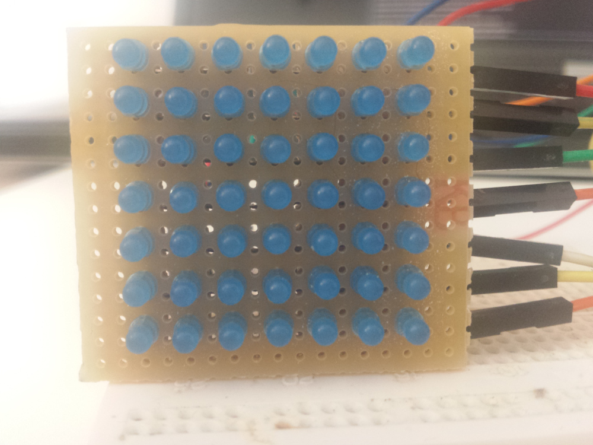
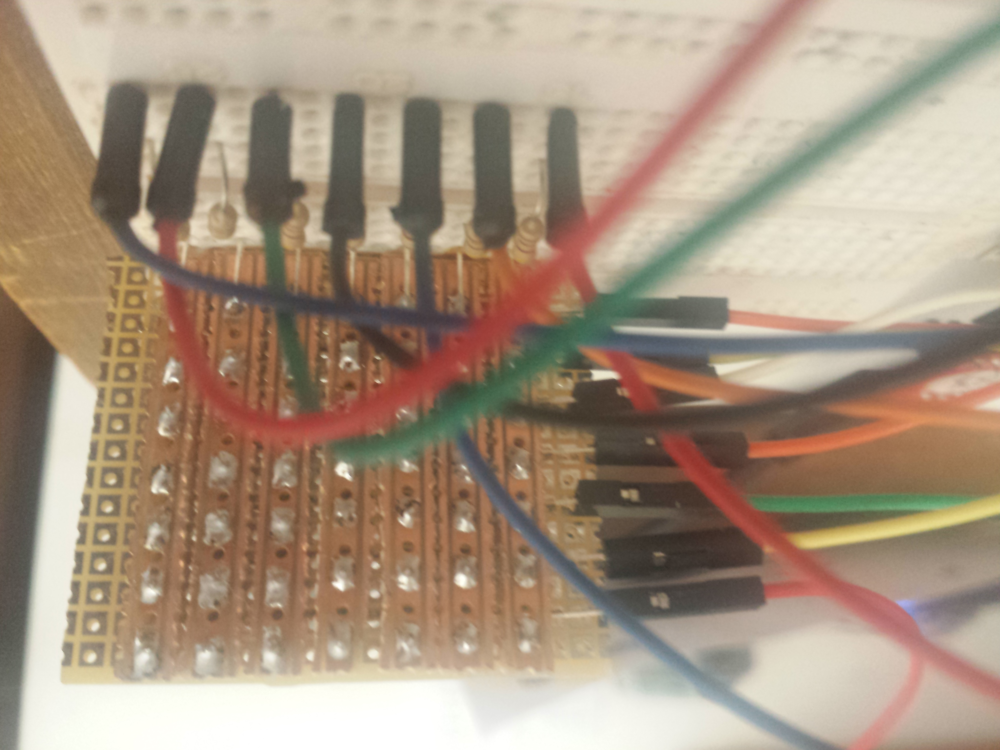

# LedMatrix
Simple LED Matrix driver library for LEDs which are driven directly from
GPIOs. Supports square LEDs up to 8x8.

## Requirements
- Arduino 1.8.x
- [SimpleTimer](https://github.com/jfturcot/SimpleTimer) library (for examples)

## Other
Prototype 7x7 assembled on stripboard:

